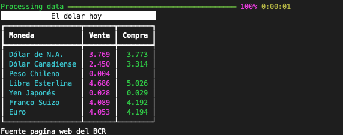

# CHACAL CLI

This project is a command line interface (cli) 


## Requirements
- Python 3.9


## Installation

Inside the repo, use the packege pip to install.

```bash
pip install --editable .
```

## Usage

```bash
 chacal dolar

```
